# PASS + GTG-Shapley 联邦学习系统交互流程图

```mermaid
graph TB
    %% ========================================
    %% 系统初始化阶段
    %% ========================================
    Start([系统启动]) --> Init[系统初始化]
    
    Init --> InitServer[服务器初始化]
    InitServer --> LoadModel["加载全局模型 M(0)"]
    LoadModel --> LoadTestData[加载中心化测试数据集]
    LoadTestData --> InitState[初始化PASS状态]
    InitState --> InitContrib["贡献分数 = 1.0"]
    InitContrib --> InitShapley["累积Shapley值 = 0.0"]
    InitShapley --> InitEval[初始评估: 准确率/损失]
    
    InitEval --> RoundStart{开始第 t 轮训练}
    
    %% ========================================
    %% 阶段1: 客户端训练
    %% ========================================
    RoundStart --> Phase1[阶段1: 客户端训练]
    
    Phase1 --> ServerSend1[服务器广播训练消息]
    ServerSend1 --> SendModel["发送全局模型 θ(t)"]
    SendModel --> SendConfig["发送训练配置<br/>lr, local_epochs"]
    
    SendConfig --> ClientReceive[所有客户端接收消息]
    ClientReceive --> ClientType{客户端类型?}
    
    ClientType -->|正常客户端| NormalTrain[在私有数据上训练]
    NormalTrain --> TrainEpochs[训练 local_epochs 轮]
    TrainEpochs --> SGDUpdate["SGD优化: θi = θ(t) - lr·∇L"]
    SGDUpdate --> GetNewParams["获得训练后参数 θi_new"]
    
    ClientType -->|AFR客户端<br/>ID=2| AFRAttack[搭便车攻击]
    AFRAttack --> AddNoise["返回原始参数+小噪声<br/>θi_new = θ(t) + N(0,0.001)"]
    AddNoise --> AFRReturn[模拟零贡献]
    
    ClientType -->|SFR客户端<br/>ID=7| SFRAttack[错误数据训练<br/>当前禁用]
    SFRAttack --> WrongData[在错误数据集上训练<br/>MNIST代替CIFAR-10]
    
    GetNewParams --> ClientReturn1[返回训练结果]
    AFRReturn --> ClientReturn1
    WrongData --> ClientReturn1
    
    ClientReturn1 --> ReturnParams["上传: θi_new, num_examples"]
    ReturnParams --> ReturnMetrics["上传: train_loss, partition_id"]
    
    %% ========================================
    %% 阶段2: FedAvg聚合
    %% ========================================
    ReturnMetrics --> Phase2[阶段2: FedAvg聚合]
    
    Phase2 --> CollectParams[服务器收集所有客户端参数]
    CollectParams --> FedAvgFormula[FedAvg加权平均聚合]
    FedAvgFormula --> CalcWeight["计算权重: wi = ni / Σn"]
    CalcWeight --> Aggregate["聚合: θ(t+1) = Σ wi · θi_new"]
    
    Aggregate --> ComputeDelta[计算客户端梯度更新]
    ComputeDelta --> DeltaFormula["Δi = θi_new - θ(t)"]
    DeltaFormula --> SaveState[保存本轮状态供下轮审计]
    SaveState --> SaveBase["保存基础模型: M(t) = θ(t)"]
    SaveBase --> SaveDeltas["保存梯度更新: Δi"]
    SaveDeltas --> SaveDataSizes["保存数据集大小: |Di|"]
    
    %% ========================================
    %% 阶段3: GTG-Shapley审计
    %% ========================================
    SaveDataSizes --> Phase3Check{"t >= 2?"}
    Phase3Check -->|否| SkipAudit[跳过审计阶段]
    Phase3Check -->|是| Phase3["阶段3: GTG-Shapley审计"]
    
    Phase3 --> ServerSend3[服务器发送审计数据包]
    ServerSend3 --> SendNewModel["发送新全局模型 θ(t+1)"]
    SendNewModel --> SendBaseModel["发送上轮基础模型 M(t-1)"]
    SendBaseModel --> SendDeltas["发送上轮梯度更新 Δi(t-1)"]
    SendDeltas --> SendDataSizes["发送数据集大小 |Di|(t-1)"]
    
    SendDataSizes --> ClientAudit[客户端执行GTG-Shapley审计]
    
    ClientAudit --> BetweenTrunc{轮间截断判断}
    BetweenTrunc --> CalcV0["计算 v0 = V(M(t-1))"]
    CalcV0 --> CalcVN["计算 vn = V(M(t))"]
    CalcVN --> CheckBetween{"|vn - v0| <= εb?"}

    
    CheckBetween -->|是| TruncBetween["触发轮间截断<br/>所有Shapley值 = 0"]
    CheckBetween -->|否| MCLoop[蒙特卡洛采样循环]
    
    MCLoop --> InitSV["初始化 Shapley值 φi = 0"]
    InitSV --> SamplingRound[第 k 轮采样]
    
    SamplingRound --> GuidedSampling[引导采样生成排列]
    GuidedSampling --> FrontM[前m个位置循环轮替]
    FrontM --> RemainRandom[剩余n-m个位置随机排列]
    RemainRandom --> Permutation["得到排列 π = (π1, π2, ..., πn)"]
    
    Permutation --> TraverseLoop[遍历排列计算边际贡献]
    TraverseLoop --> InitPrevAcc["初始化 v0 = V(M(t-1))"]
    InitPrevAcc --> ForEachClient{"对每个客户端 πj"}
    
    ForEachClient --> WithinTrunc{轮内截断判断}
    WithinTrunc --> CheckWithin{"|vn - vj-1| < εi?"}
    
    CheckWithin -->|是| TruncWithin["触发轮内截断<br/>marginal = 0"]
    CheckWithin -->|否| ReconstructModel[重构子模型]
    
    ReconstructModel --> SubsetS["子集 S = (π1, ..., πj)"]
    SubsetS --> ReconFormula["重构公式: Ms = M(t-1) + Σ(|Di|/|Ds|)·Δi"]
    ReconFormula --> EvalSubset["评估子模型: vj = V(Ms)"]
    EvalSubset --> CalcMarginal["计算边际贡献<br/>marginal = vj - vj-1"]
    
    TruncWithin --> UpdateSV[增量更新Shapley值]
    CalcMarginal --> UpdateSV
    UpdateSV --> SVFormula["φi = ((k-1)/k)·φi + (1/k)·marginal"]
    
    SVFormula --> NextClient{还有客户端?}
    NextClient -->|是| ForEachClient
    NextClient -->|否| CheckConverge{收敛判定}
    
    CheckConverge --> CalcCV["计算变异系数<br/>CV = std/mean"]
    CalcCV --> CVCheck{"CV < threshold?"}
    
    CVCheck -->|是| Converged[提前收敛]
    CVCheck -->|否| CheckMaxRounds{"k < max_rounds?"}
    
    CheckMaxRounds -->|是| SamplingRound
    CheckMaxRounds -->|否| MaxReached[达到最大采样轮数]
    
    Converged --> ReturnSV[返回Shapley值]
    MaxReached --> ReturnSV
    TruncBetween --> ReturnSV
    
    ReturnSV --> ClientReturn3[客户端上传Shapley值矩阵]
    ClientReturn3 --> UploadSV["上传: shapley_cid1, shapley_cid2, ..."]
    
    %% ========================================
    %% 阶段4: 贡献评估与剔除
    %% ========================================
    UploadSV --> Phase4[阶段4: 贡献评估与剔除]
    SkipAudit --> Phase4
    
    Phase4 --> CollectSV[服务器收集所有Shapley值]
    CollectSV --> BuildMatrix["构建Shapley值矩阵<br/>SVij = 客户端j对客户端i的评估"]
    
    BuildMatrix --> CalcMeanSV[计算每个客户端的平均Shapley值]
    CalcMeanSV --> MeanFormula["mean_SVi = (1/(N-1))·Σj SVij"]
    
    MeanFormula --> UpdateCumulative[更新累积Shapley值]
    UpdateCumulative --> CumFormula["cumulative_SVi += mean_SVi"]
    
    CumFormula --> RankClients[基于累积值排名客户端]
    RankClients --> SortBySV["按cumulative_SVi升序排序"]
    SortBySV --> CalcRankScore["计算排名分数<br/>rank_score = rank/(n-1)"]
    
    CalcRankScore --> UpdateContrib[更新贡献分数]
    UpdateContrib --> ContribFormula["scorei = α·old_scorei + (1-α)·rank_score"]
    ContribFormula --> SmoothScore[移动平均平滑分数变化]
    
    SmoothScore --> CalcThreshold[计算剔除阈值]
    CalcThreshold --> ThresholdFormula["threshold = 1/(β·N)"]
    
    ThresholdFormula --> CheckEliminate{对每个客户端}
    CheckEliminate --> CompareScore{"scorei < threshold?"}
    
    CompareScore -->|是| Eliminate[剔除客户端 i]
    Eliminate --> MarkFreeRider["标记为搭便车者 ⚠️"]
    MarkFreeRider --> PrintEliminate[打印剔除信息]
    
    CompareScore -->|否| Keep[保留客户端 i]
    Keep --> PrintKeep[打印贡献分数]
    
    PrintEliminate --> UpdateGlobal[更新全局模型]
    PrintKeep --> UpdateGlobal
    UpdateGlobal --> FinalModel["最终模型 = θ(t+1)"]
    
    %% ========================================
    %% 评估与保存
    %% ========================================
    FinalModel --> Evaluate[中心化评估]
    Evaluate --> TestOnCentral[在中心化测试集上评估]
    TestOnCentral --> CalcMetrics[计算准确率和损失]
    CalcMetrics --> PrintMetrics[打印评估结果]
    
    PrintMetrics --> NextRound{继续下一轮?}
    NextRound -->|"是<br/>t < max_rounds"| RoundStart
    NextRound -->|否| SaveModel[保存最终模型]
    
    SaveModel --> SavePath[保存到 final_model_gtg.pt]
    SavePath --> End([训练完成])
    
    %% ========================================
    %% 样式定义
    %% ========================================
    classDef initStyle fill:#e1f5ff,stroke:#0066cc,stroke-width:3px,color:#000,font-weight:bold
    classDef phase1Style fill:#fff4e1,stroke:#ff9900,stroke-width:3px,color:#000,font-weight:bold
    classDef phase2Style fill:#e8f5e9,stroke:#4caf50,stroke-width:3px,color:#000,font-weight:bold
    classDef phase3Style fill:#f3e5f5,stroke:#9c27b0,stroke-width:3px,color:#000,font-weight:bold
    classDef phase4Style fill:#ffe0e0,stroke:#f44336,stroke-width:3px,color:#000,font-weight:bold
    classDef evalStyle fill:#e0f7fa,stroke:#00bcd4,stroke-width:3px,color:#000,font-weight:bold
    classDef attackStyle fill:#ffcccc,stroke:#cc0000,stroke-width:4px,color:#000,font-weight:bold
    classDef eliminateStyle fill:#ff6666,stroke:#990000,stroke-width:4px,color:#fff,font-weight:bold
    classDef keepStyle fill:#ccffcc,stroke:#009900,stroke-width:3px,color:#000,font-weight:bold
    
    class Init,InitServer,LoadModel,LoadTestData,InitState,InitContrib,InitShapley,InitEval initStyle
    class Phase1,ServerSend1,SendModel,SendConfig,ClientReceive,ClientType,NormalTrain,TrainEpochs,SGDUpdate,GetNewParams,ClientReturn1,ReturnParams,ReturnMetrics phase1Style
    class Phase2,CollectParams,FedAvgFormula,CalcWeight,Aggregate,ComputeDelta,DeltaFormula,SaveState,SaveBase,SaveDeltas,SaveDataSizes phase2Style
    class Phase3,ServerSend3,SendNewModel,SendBaseModel,SendDeltas,SendDataSizes,ClientAudit,BetweenTrunc,CalcV0,CalcVN,CheckBetween,MCLoop,InitSV,SamplingRound,GuidedSampling,FrontM,RemainRandom,Permutation,TraverseLoop,InitPrevAcc,ForEachClient,WithinTrunc,CheckWithin,ReconstructModel,SubsetS,ReconFormula,EvalSubset,CalcMarginal,UpdateSV,SVFormula,NextClient,CheckConverge,CalcCV,CVCheck,Converged,MaxReached,ReturnSV,ClientReturn3,UploadSV,TruncBetween,TruncWithin phase3Style
    class Phase4,CollectSV,BuildMatrix,CalcMeanSV,MeanFormula,UpdateCumulative,CumFormula,RankClients,SortBySV,CalcRankScore,UpdateContrib,ContribFormula,SmoothScore,CalcThreshold,ThresholdFormula,CheckEliminate,CompareScore,UpdateGlobal,FinalModel phase4Style
    class Evaluate,TestOnCentral,CalcMetrics,PrintMetrics evalStyle
    class AFRAttack,AddNoise,AFRReturn,SFRAttack,WrongData attackStyle
    class Eliminate,MarkFreeRider,PrintEliminate eliminateStyle
    class Keep,PrintKeep keepStyle
```



## 流程图说明

### 阶段划分与颜色标识

- **蓝色**: 系统初始化阶段
- **橙色**: 阶段1 - 客户端训练
- **绿色**: 阶段2 - FedAvg聚合
- **紫色**: 阶段3 - GTG-Shapley审计
- **红色**: 阶段4 - 贡献评估与剔除
- **青色**: 评估与保存
- **深红色**: 搭便车者攻击和剔除

### 关键技术点

#### 1. GTG-Shapley三层截断机制

- **轮间截断**: `|V(M^(t+1)) - V(M^(t))| ≤ ε_b` → 跳过本轮审计
- **轮内截断**: `|V_N - V_{j-1}| < ε_i` → 后续边际贡献为0
- **引导采样**: 前m个位置循环轮替,剩余位置随机排列

#### 2. 子模型重构公式

```
M̃_S = M^(t) + Σ_{i∈S} (|D_i|/|D_S|) * Δ_i
```

避免重复训练,直接从梯度更新重构子模型。

#### 3. Shapley值增量更新

```
φ_i^(k) = ((k-1)/k) * φ_i^(k-1) + (1/k) * marginal
```

在线更新,无需存储所有历史边际贡献。

#### 4. 贡献分数计算

```
cumulative_SV_i += mean(SV_i)
rank_score = rank / (n-1)
score_i = α * old_score_i + (1-α) * rank_score
```

基于累积Shapley值的相对排名,使用移动平均平滑。

#### 5. 剔除判定

```
threshold = 1 / (β * N)
if score_i < threshold → ELIMINATED
```

### 数据流向

1. **训练阶段**: `θ^t → 客户端 → θ_i^new`
2. **聚合阶段**: `{θ_i^new} → FedAvg → θ^(t+1), {Δ_i}`
3. **审计阶段**: `{M^t, Δ_i, |D_i|} → GTG-Shapley → {SV_ij}`
4. **剔除阶段**: `{SV_ij} → 排名评分 → 剔除决策`

### 搭便车者检测

- **AFR客户端(ID=2)**: 返回原始参数+小噪声,模拟零贡献
- **检测机制**: Shapley值低 → 累积排名低 → 贡献分数低 → 被剔除

### 性能优化

- **缓存评估结果**: 避免重复评估相同子集
- **收敛判定**: 变异系数 < threshold 提前停止采样
- **共享排列**: 一次排列计算所有客户端的边际贡献
