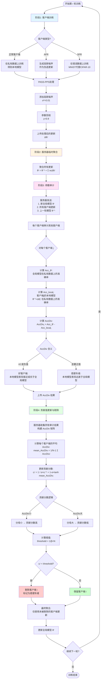

```mermaid
graph TB
    Start([开始第 r 轮训练]) --> Phase1[阶段1: 客户端训练]
    
    Phase1 --> Train{客户端类型?}
    Train -->|正常客户端| NormalTrain[在私有数据上训练<br/>得到本地模型]
    Train -->|AFR| AFRNoise[生成高斯噪声<br/>作为伪造更新]
    Train -->|SFR| SFRTrain[在错误数据上训练<br/>MNIST代替CIFAR-10]
    
    NormalTrain --> PPS1[PASS-PPS处理]
    AFRNoise --> PPS1
    SFRTrain --> PPS1
    
    PPS1 --> Noise[添加高斯噪声<br/>σ²=0.01]
    Noise --> Prune[参数剪枝<br/>γ=0.9]
    Prune --> Upload[上传处理后的更新<br/>Δθᵢʳ]
    
    Upload --> Phase2[阶段2: 服务器临时聚合]
    Phase2 --> TempAgg[聚合所有更新<br/>θʳ = θʳ⁻¹ + Σ wᵢΔθᵢʳ]
    
    TempAgg --> Phase3[阶段3: 参数审计]
    Phase3 --> SendAudit[服务器发送:<br/>1. 新全局模型 θʳ<br/>2. 所有客户端更新<br/>3. 上一轮模型 θʳ⁻¹]
    
    SendAudit --> ClientAudit[每个客户端审计其他客户端]
    ClientAudit --> AuditLoop{对每个客户端 j}
    
    AuditLoop --> CalcAcc1[计算 Acc_θʳ:<br/>全局模型在私有数据上的准确率]
    CalcAcc1 --> CalcAcc2[计算 Acc_localⱼ:<br/>客户端j的本地模型<br/>θʳ⁻¹+Δθⱼʳ 在私有数据上的准确率]
    CalcAcc2 --> CalcAccDiv[计算 AccDiv:<br/>AccDivⱼ = Acc_θʳ - Acc_localⱼ]
    
    CalcAccDiv --> AccDivResult{AccDiv 含义}
    AccDivResult -->|≈0 或负值| GoodClient[好客户端:<br/>本地模型表现接近或优于全局模型]
    AccDivResult -->|显著正值| BadClient[搭便车者:<br/>本地模型表现远差于全局模型]
    
    GoodClient --> UploadAccDiv[上传 AccDiv 结果]
    BadClient --> UploadAccDiv
    
    UploadAccDiv --> Phase4[阶段4: 贡献值更新与剔除]
    Phase4 --> CollectAccDiv[服务器收集所有审计结果<br/>构建 AccDiv 矩阵]
    
    CollectAccDiv --> CalcMean[计算每个客户端的平均 AccDiv:<br/>mean_AccDivᵢ = 1/N-1 Σ AccDivᵢʲ]
    CalcMean --> UpdateScore[更新贡献分数:<br/>cᵢʳ = 1 / α×cᵢʳ⁻¹ + 1-α×tanh mean_AccDivᵢ]
    
    UpdateScore --> ScoreLogic{贡献分数逻辑}
    ScoreLogic -->|AccDiv小| HighScore[分母小 → 贡献分数高]
    ScoreLogic -->|AccDiv大| LowScore[分母大 → 贡献分数低]
    
    HighScore --> CalcThreshold[计算阈值:<br/>threshold = 1/β×N]
    LowScore --> CalcThreshold
    
    CalcThreshold --> CheckThreshold{cᵢʳ < threshold?}
    CheckThreshold -->|是| Eliminate[剔除客户端 i<br/>标记为搭便车者]
    CheckThreshold -->|否| Keep[保留客户端 i]
    
    Eliminate --> FinalAgg[最终聚合:<br/>仅使用未被剔除的客户端更新]
    Keep --> FinalAgg
    
    FinalAgg --> UpdateGlobal[更新全局模型 θʳ]
    UpdateGlobal --> NextRound{继续下一轮?}
    NextRound -->|是| Start
    NextRound -->|否| End([训练结束])
    
    style Phase1 fill:#e1f5ff
    style Phase2 fill:#fff4e1
    style Phase3 fill:#ffe1f5
    style Phase4 fill:#e1ffe1
    style Eliminate fill:#ffcccc
    style Keep fill:#ccffcc
```